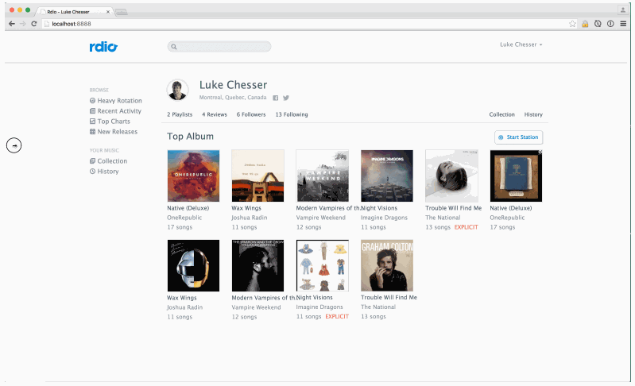

## **TP Responsive Web Design React**

1. Ajouter [Reactstrap](https://reactstrap.github.io/) à votre projet

2. Centrer les éléments sur la page grace à un container Bootstrap

3. Utiliser la [grille](https://reactstrap.github.io/components/layout/) fluide de Reactstrap pour définir la largeur des éléments :

   - Menu
   - Partie principale

4. Utiliser les classes de grille (col-xs-_ / col-md-_ etc.) pour afficher successivement les albums par 6 sur grand écran, 4 pour les tablettes et 2 en dessous

5. Redimensionner la fenêtre du navigateur ou émuler la taille du device à travers la console dévelopeur. Tester que la page est visuellement cohérente à toutes les résolutions. Faire les ajustements nécessaires avec les media queries
